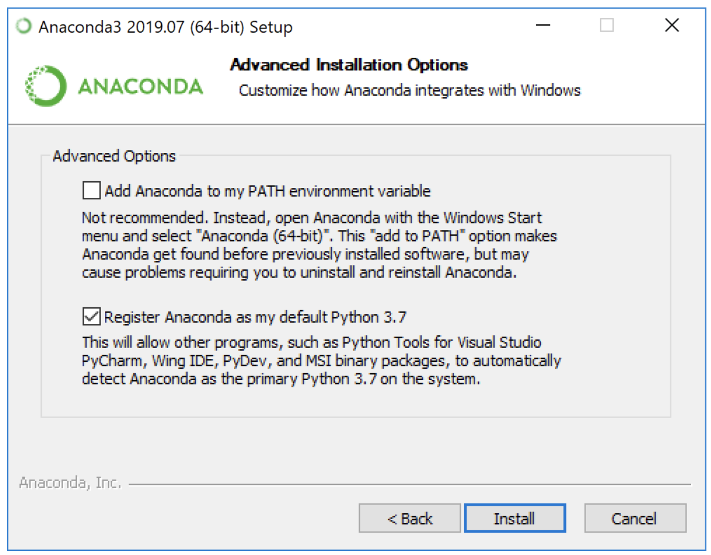

# machine-learning-tutorial
A collection of jupyter notebooks to walk through some of the machine learning pipelines we use in research.

# Prerequisite: Installing Anaconda
Follow the [documentation for installing anaconda](https://docs.anaconda.com/anaconda/install/). 
- On Windows, you'll get some advanced options. If you don't know what to choose...
        - 
        - Select neither of these things.
        - Set your PATH environment variable to include the install location you just chose. See step 2 of this [tutorial](https://www.pythoncentral.io/add-python-to-path-python-is-not-recognized-as-an-internal-or-external-command/).

When complete, please run the following and send a screenshot of each to jamie.brandon@callminer.com. If something breaks, feel free to email for help too.

1. Ensure you've installed python correctly. From terminal, enter the following. Screencap the output
        
        python
        >>> import this
        >>> quit()
        
2. Install `gensim`. Screencap the output

        pip install gensim
        python
        >>> import gensim
        >>> quit()
        
3. Ensure that you can open a [jupyter notebook](https://jupyter-notebook-beginner-guide.readthedocs.io/en/latest/execute.html). Screencap the output
     1. On Mac & linux, from terminal, enter the following commands.
            
            jupyter notebook
            
     2. On Windows, open the desktop app `Jupyter Notebook`.

4. Optional: set jupyter notebook to dark mode
     1. In the terminal, enter the following commands
          ```
           pip install jupyterthemes
           jt -t chesterish
            ```
     2. For more theme options, go to `https://github.com/dunovank/jupyter-themes`.
     3. Restart jupyter notebook
     
# Course Expectations
 - you're ready to learn, ready to fail, ready to try again
 
# Schedule
## Day 1
  - predictive modeling using `machine_learning_tutorial.ipynb`
  - word embeddings using `word_embedding_tutorial.ipynb`
  
## Day 2
  - different algorithms for training word embeddings 
  - clustering word embeddings
